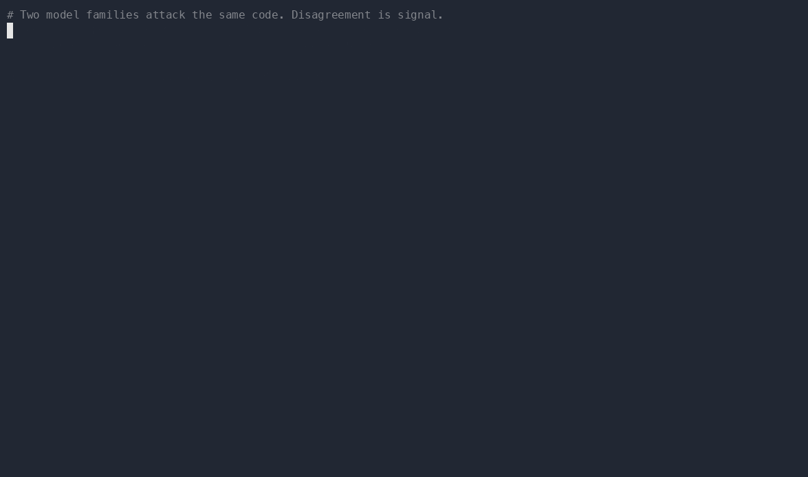

# Gauntlet

> _Make every answer run the gauntlet._

**Red-team and compare LLMs (Claude, Gemini, GPT, Grok, local models) against each other, from inside the CLI you already use.** An answer that survives attacks from three different model families is sturdier than one any single model is happy with.

<!-- DEMO: replace the line below with your recording once captured. See docs/recording-a-demo.md -->
<p align="center">
  
</p>

This is an opinionated configuration layer on top of [PAL MCP](https://github.com/BeehiveInnovations/pal-mcp-server) (the open-source Provider Abstraction Layer, formerly Zen MCP). PAL does the hard part: it exposes many model providers through one MCP server. This kit adds the part PAL doesn't ship, a ready-to-run setup and a prompt playbook for **adversarial review and head-to-head comparison** across models.

> **What this is / isn't.** This repo does **not** contain or fork the PAL server code. It's a thin layer, config presets, an installer that pulls upstream PAL, and a documented workflow. All credit for the server itself goes to the PAL MCP maintainers ([BeehiveInnovations](https://github.com/BeehiveInnovations/pal-mcp-server), Apache-2.0). See [NOTICE](./NOTICE).

---

## Why red-team across models

A single model is a single point of failure. It has consistent blind spots, a house style, and failure modes that don't show up when you only ask it to check its own work. Putting two or more models in an adversarial loop surfaces what any one of them misses:

- **Catch what one model rationalizes.** Claude writes the code; Gemini and GPT are asked to break it. Disagreement is signal.
- **Compare instead of guess.** Run the same prompt across models side by side and read the deltas, not the marketing.
- **Force a real decision.** A structured consensus tool makes each model commit to a position and defend it, instead of hedging.

This is useful for security review, architecture decisions, prompt/eval hardening, and "which model should I actually use for X" questions.

---

## How it works

```
        Your CLI (Claude Code / Codex / Cursor / Gemini CLI)
                              │
                              ▼
                    ┌──────────────────┐
                    │   PAL MCP server │   ← provider abstraction layer
                    └──────────────────┘
                       │    │    │    │
              ┌────────┘    │    │    └────────┐
              ▼             ▼    ▼             ▼
           Gemini        OpenAI  Anthropic    Grok / local
        (your keys)     (your keys)        (Ollama, etc.)
```

You drive everything from your existing CLI. PAL routes each sub-request to the model you name. This kit configures which providers are on and gives you the prompts that turn that into a red-team loop.

---

## Quickstart

**Prereqs:** Python 3.10+, git, and API keys for at least two providers (the more, the better the cross-checking).

```bash
# 1. Clone this kit
git clone https://github.com/<your-username>/gauntlet-mcp.git
cd gauntlet-mcp

# 2. Run the installer, clones upstream PAL and wires in the red-team config
./install.sh

# 3. Add your API keys
cp .env.example pal-mcp-server/.env
# edit pal-mcp-server/.env and fill in the keys you have

# 4. Register the server with your CLI (see config/ for templates)
```

Then point your MCP client at the server using a template in [`config/`](./config):
- **Claude Desktop / Claude Code** → [`config/claude-desktop.json`](./config/claude-desktop.json)
- **Claude Code (CLI)** → [`config/claude-code.md`](./config/claude-code.md)

**Providers work out of the box.** Gemini, OpenAI, Anthropic, Grok, Azure, OpenRouter, and local models are all supported by the server underneath. You don't wire anything up, you add a key and that model becomes callable by name. Run at least two providers from different vendors so the models checking each other have different blind spots. Full setup and a plug-in path for new providers: [`config/providers.md`](./config/providers.md). Quick key reference: [`.env.example`](./.env.example).

---

## The red-team workflow

Each pattern below has a full prompt template in [`prompts/`](./prompts). The short version:

### 1. Adversarial review, one model attacks another's work
```
Use challenge to pressure-test the auth refactor I just wrote.
Then use clink with gemini codereviewer to find what challenge missed.
```
The `challenge` tool forces a critical stance instead of agreeable validation. Pairing it with a *different* model via `clink` means a second architecture is doing the attacking. → [`prompts/red-team-review.md`](./prompts/red-team-review.md)

### 2. Consensus, make models commit and defend
```
Use consensus with gemini-pro (for) and gpt-5 (against) to decide:
should we ship the new caching layer this sprint?
```
`consensus` assigns stances and collects defended positions, so you read a real debate, not three hedged paragraphs. → [`prompts/model-consensus.md`](./prompts/model-consensus.md)

### 3. Comparison matrix, same prompt, every model, side by side
```
Run this prompt through gemini-pro, gpt-5, and opus, and build a
comparison matrix: correctness, reasoning depth, what each one missed.
```
→ [`prompts/comparison-matrix.md`](./prompts/comparison-matrix.md)

### 4. Cross-model debate, iterate to a stronger answer
```
Have gemini propose, gpt critique, then claude synthesize.
Loop until no new objections survive.
```
→ [`prompts/adversarial-debate.md`](./prompts/adversarial-debate.md)

---

## Tools you'll use most

These ship with PAL; this kit just tells you when to reach for which.

| Tool | Use it to | Red-team role |
|------|-----------|---------------|
| `challenge` | Force a critical, non-agreeable response | The attacker |
| `consensus` | Get defended for/against positions from named models | The debate |
| `clink` | Hand a task to a *different* CLI/model in a fresh context | Second architecture |
| `thinkdeep` | Extended-reasoning pass on a hard problem | The deep check |
| `codereview` / `secaudit` | Structured review/security passes | The auditor |
| `consensus` + `clink` | Propose → critique → synthesize loop | The full red team |

Full tool docs: [PAL MCP tools](https://github.com/BeehiveInnovations/pal-mcp-server/tree/main/docs/tools).

---

## For clients and reviewers

If someone hands you this and you're not deep in CLIs: read [`docs/red-teaming.md`](./docs/red-teaming.md). It explains, in plain terms, how to read a multi-model review and how much to trust agreement vs. disagreement between models.

---

## Contributing

New prompt patterns, config presets, and installer improvements are welcome, see [CONTRIBUTING.md](./CONTRIBUTING.md). Changes to the PAL server itself go [upstream](https://github.com/BeehiveInnovations/pal-mcp-server), not here. Want to swap in your own demo recording? See [`docs/recording-a-demo.md`](./docs/recording-a-demo.md).

---

## Credits & license

Built on **[PAL MCP](https://github.com/BeehiveInnovations/pal-mcp-server)** by BeehiveInnovations, licensed Apache-2.0. This kit (the configuration, installer, and playbook) is also Apache-2.0, see [LICENSE](./LICENSE) and [NOTICE](./NOTICE). The PAL server is **not** redistributed here; the installer fetches it from the official source.
